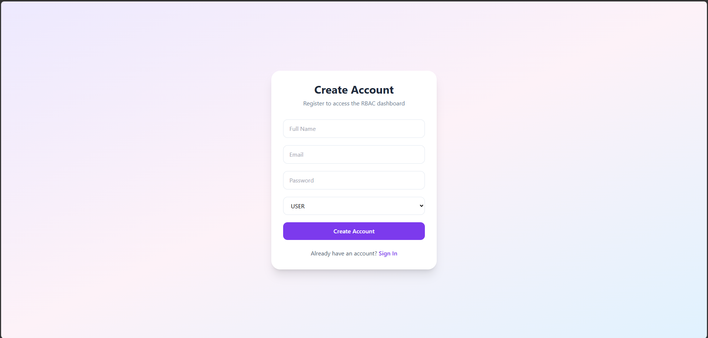
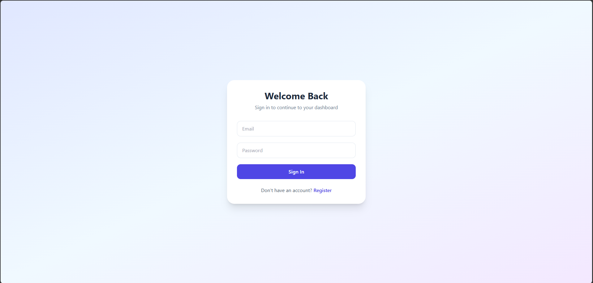
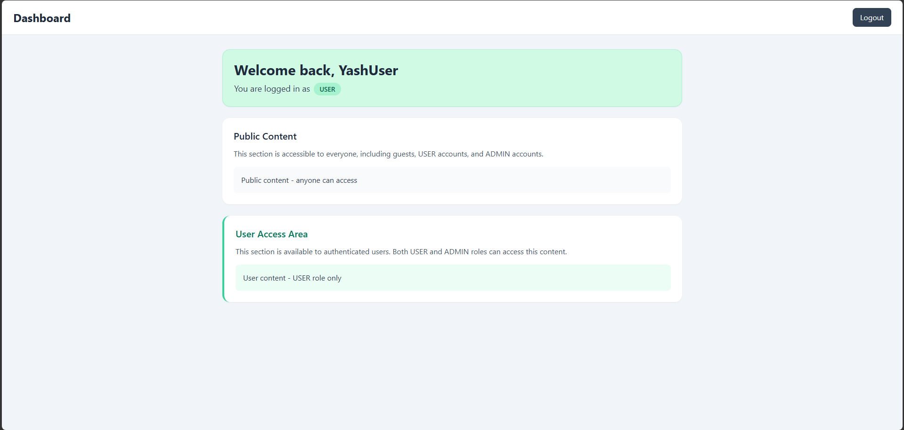
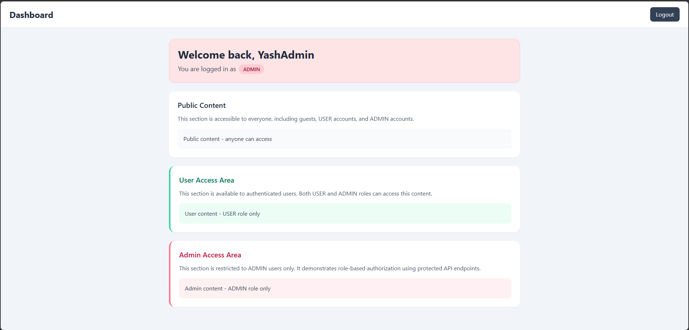

## Overview

This project is a full-stack authentication and role-based access control (RBAC) application built with **Spring Boot** and **React + TypeScript**.

The application allows users to:

* Register with name, email, password, and role
* Login using email and password
* Receive JWT token authentication
* Access protected content based on assigned role
* View role-based UI sections on the dashboard

---

# Tech Stack

## Backend
* Spring Boot
* Spring Security
* JWT Authentication
* Spring Data JPA
* Hibernate
* MapStruct
* Lombok
* Maven
* Swagger

## Frontend

* React
* TypeScript
* Vite
* React Router
* React Query
* Axios
* React Hook Form
* TailwindCSS

---

# Features

## Authentication

* User Registration
* User Login
* JWT token generation
* Secure token-based API authentication

## Role-Based Access Control

Two roles are supported:

### USER

Can access:

* Public content
* User content

### ADMIN

Can access:

* Public content
* User content
* Admin content

---

# API Access Rules

| Endpoint             |       Access |
| -------------------- | -----------: |
| `/api/public`        |       Public |
| `/api/user/content`  | USER / ADMIN |
| `/api/admin/content` |   ADMIN only |

---

# Frontend Pages

## Register Page

Users can register with:

* Name
* Email
* Password
* Role (`USER` / `ADMIN`)

---

## Login Page

Users can login using:

* Email
* Password

---

## Dashboard Page

Dashboard displays:

* Public content section
* User content section
* Admin content section (ADMIN only)

The UI changes dynamically based on logged-in user role.

---

# Project Structure

## Backend

```bash
src/main/java
├── controller
├── service
├── repository
├── entity
├── dto
├── mapper
├── security
└── config
```

---

## Frontend

```bash
src
├── api
├── components
├── context
├── pages
├── types
└── App.tsx
```

---

# Setup Instructions

## Backend Setup

### 1. Clone repository

```bash
git clone <repository-url>
cd backend
```

---

### 2. Configure database

Update `application.properties`

```properties
spring.datasource.url=jdbc:mysql://localhost:3306/your_database
spring.datasource.username=your_username
spring.datasource.password=your_password
```

---

### 3. Run backend

```bash
./mvnw spring-boot:run
```

Backend runs on:

```bash
http://localhost:8080
```

---

## Frontend Setup

### 1. Navigate to frontend

```bash
cd frontend
```

---

### 2. Install dependencies

```bash
npm install
```

---

### 3. Run frontend

```bash
npm run dev
```

Frontend runs on:

```bash
http://localhost:5173
```

---

# Swagger API Documentation

Swagger UI available at:

```bash
http://localhost:8080/swagger-ui/index.html
```

---

# Screenshots

## Register Page



## Login Page



## Dashboard – USER Role



## Dashboard – ADMIN Role


